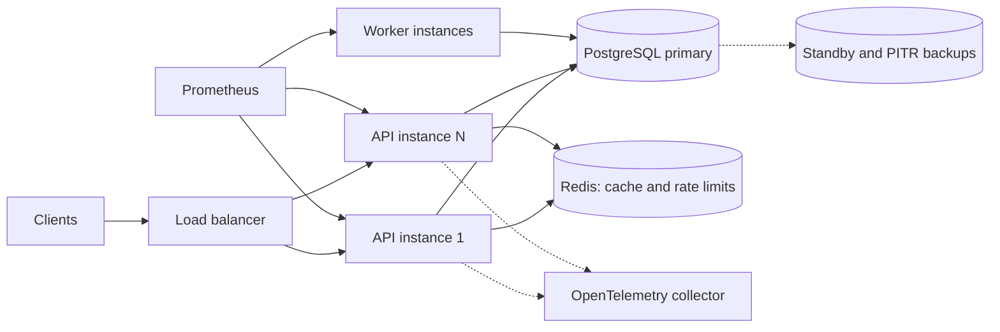
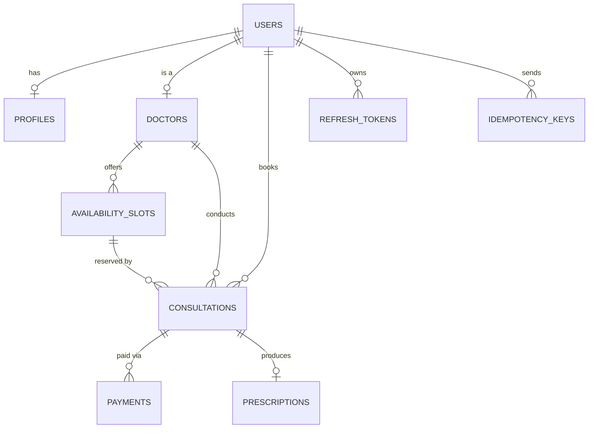
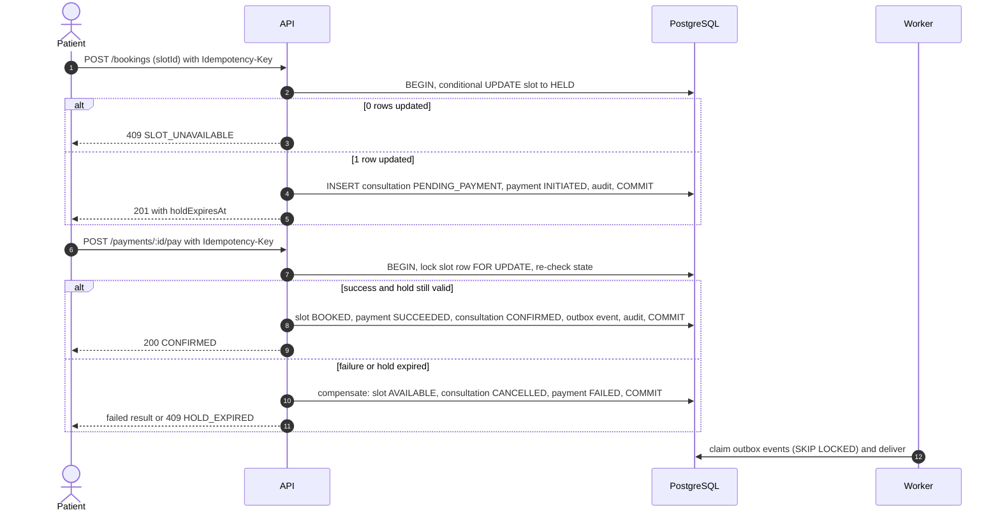
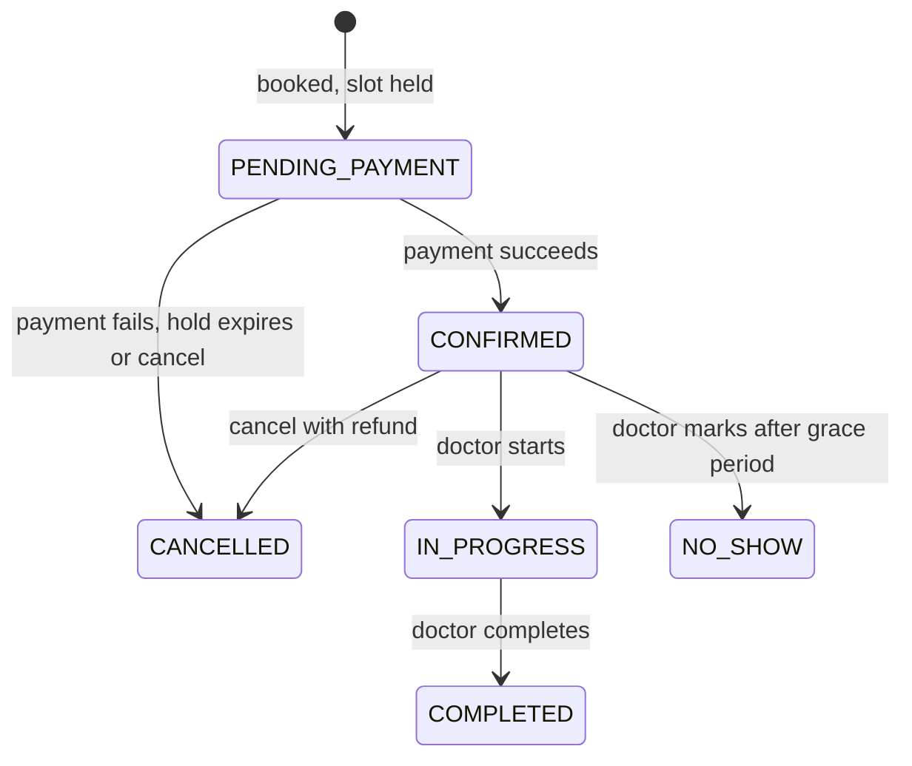

# Amrutam Telemedicine Backend: Architecture

## 1. Goals and how the design meets them

| Requirement | How it is met | Status |
|---|---|---|
| ~100k consultations/day | Stateless API instances behind a load balancer, one PostgreSQL primary, short transactions (section 6) | Designed, not load-tested |
| p95 < 200 ms reads, < 500 ms writes | Indexed queries, Redis read-through cache, two short transactions per booking, latency histogram with 200 ms / 500 ms buckets and alerts | Instrumented, not yet measured under load |
| 99.95% availability (about 22 min/month) | 3+ API replicas, zero-downtime rolling deploys, readiness probes, pod disruption budget, multi-AZ database with automatic failover (section 10) | Manifests in repo, DB failover is an infrastructure choice |
| No double booking, no duplicate writes | Database constraints plus idempotency keys (sections 4 and 5) | Implemented and tested |
| MFA, RBAC, encryption, audit | TOTP MFA, role checks, AES-256-GCM field encryption, append-only audit log | Implemented and tested |
| Observability, CI/CD | Prometheus metrics, OpenTelemetry traces, structured logs, GitHub Actions, Docker, Kubernetes | Implemented; the CI pipeline runs green on GitHub (type-check, tests with coverage, dependency audit, secret scan, CodeQL, image build and vulnerability scan) |

## 2. System architecture

A **modular monolith plus a background worker**, chosen over microservices for a small team and a short build: one deployable unit, one database, transactions that span booking, payment and audit without distributed-transaction machinery. Modules (`auth`, `users`, `doctors`, `slots`, `bookings`, `payments`, `consultations`, `prescriptions`, `admin`) are separated by folder and only talk through service functions, so any of them can be extracted later.

**Request pipeline** (every API call): request id and structured log, metrics timer, security headers, global rate limit, JSON parsing (100 KB cap), then per route: `authenticate` (JWT) -> `authorize` (role, plus MFA for staff when enforced) -> body validation (Zod) -> idempotency check -> controller -> service (business rules) -> Prisma. Errors flow to one handler that returns a uniform `{ error: { code, message } }` and never leaks internals.

**API and worker are separate processes** from the same image. Slow jobs (notification delivery, hold expiry, analytics refresh, housekeeping) never compete with request latency and scale independently. Every job is safe on many instances at once.

**Redis is an accelerator, never a dependency.** If it is down the API keeps serving: cache misses fall through to the database and rate limiting fails open.

## 3. Data model

Besides these, `audit_logs` (append-only, partitioned), `outbox_events` (pending notifications) and `daily_stats` (pre-aggregated analytics) have no foreign keys by design. The full diagram with columns is in `docs/er-diagram.md`.

Three constraints do the heavy lifting for correctness, enforced by the database rather than trusted to application code:
- `no_overlapping_slots`: an exclusion constraint (`btree_gist`) so a doctor's slots can never overlap.
- `uniq_active_consultation_per_slot`: a partial unique index, at most one non-cancelled consultation per slot.
- `audit_logs` trigger: rejects UPDATE and DELETE, so history cannot be rewritten through SQL row operations.

## 4. Booking flow: saga, transactions and concurrency

Booking is a **saga** with a compensating action, kept inside one database so each step is a real ACID transaction.

**How double booking is prevented.** The claim is a single statement: `UPDATE slot SET status='HELD' WHERE id=? AND (status='AVAILABLE' OR hold expired)`. PostgreSQL row-locks the slot, so of N simultaneous requests one matches and the others match zero rows and get 409. A test races 30 patients for one slot: exactly one wins. The partial unique index is an independent second barrier.

**Deadlock avoidance.** Every path that changes a slot (book, pay, cancel, expire) takes the slot row lock first and touches consultation and payment rows after, so lock order is identical everywhere.

**Holds.** A hold lasts 10 minutes (`SLOT_HOLD_MINUTES`). A patient may have at most 3 unpaid holds, so one account cannot lock up a doctor's calendar. An expired hold can be taken over by the next patient immediately; the worker also releases expired holds so they do not linger and the unpaid consultation is closed.

**Consultation lifecycle** (each transition is `UPDATE ... WHERE status = <expected>`, so racing requests cannot both apply, and repeating a completed transition returns the current state):

## 5. Idempotency, retries and backoff

**Idempotency** (required on booking, payment and prescription; optional elsewhere). The unique `(user_id, key)` constraint acts as the lock. The first request stores its response before it is sent; a repeat with the same key and body replays that response (`Idempotent-Replayed: true`); the same key with a different body returns 422; the same key while the first is still running returns 409 with `Retry-After`. Requests are fingerprinted with a SHA-256 of canonical JSON, so key order does not matter. 5xx responses are not stored, so clients can safely retry. Keys expire after 24 h and are purged by the worker. A request that never finished (crash) can be retaken after 60 s.

**Outbox with retry and backoff.** State changes and their notification events are written in the same transaction (transactional outbox), so an event exists if and only if the change committed. The worker claims events with `FOR UPDATE SKIP LOCKED` and a 60-second lease (a crashed worker's events reappear). Delivery is at-least-once. On failure the retry delay is `5 s x 2^(attempt-1)`, capped at 1 hour; after 8 attempts an event becomes `DEAD` and raises an alert for a human. Handlers must be idempotent.

## 6. Scaling and data partitioning

**Back-of-envelope (estimate, not measured).** 100k consultations/day is about 1.2 per second on average; at a 10x peak, about 12 bookings/s, each two short write transactions, plus perhaps 20 reads per booking (search, slots). That is roughly 25 writes/s and a few hundred reads/s: comfortably within one well-sized PostgreSQL primary. The API is stateless, so reads scale by adding replicas and, if needed, database read replicas for search and analytics.

**Implemented partitioning.** `audit_logs` is the highest-volume table (on the order of a million rows a day at this scale). It is range-partitioned by month: indexes stay small, recent data stays hot, and retention is a cheap `DROP` of an old partition. A default partition is a safety net, a SQL function creates future partitions idempotently, and the worker keeps the next months created. Analytics do not scan operational tables: the worker maintains `daily_stats`, and the audit endpoint uses keyset pagination (constant cost however deep the page).

**Next step (not implemented).** `consultations` would be partitioned by `scheduled_at` (about 36M rows/year). Caveat: unique indexes on a partitioned table must include the partition key, so `uniq_active_consultation_per_slot` would need rework; the slot row lock already serializes bookings, so correctness would still hold.

## 7. Caching

Doctor search and detail use a Redis read-through cache (30 s TTL). Invalidation is by **version bump**: creating or editing a doctor increments a namespace version, making all old keys unreachable (they expire on their own), so no key scanning is needed. Anything that depends on availability is never cached because it changes constantly. Cache hits and misses are exported as metrics.

## 8. Security (summary; details in the threat model)

Passwords use bcrypt; access tokens live 15 minutes; refresh tokens are stored only as SHA-256 hashes, rotate on every use, and replaying an old one revokes every session. TOTP MFA has replay protection, and `MFA_ENFORCE_STAFF` makes doctor and admin routes require an MFA-verified session. Patient phone numbers, clinical notes, prescriptions and MFA secrets are encrypted with AES-256-GCM from a versioned key ring (rotatable without downtime); each ciphertext is bound to its row, so copying it elsewhere fails to decrypt. Admins cannot read clinical notes or prescriptions (least privilege), and every read of medical data is audited before it is returned. Resources a user may not see return 404, not 403.

## 9. Observability

- **Metrics** (`/metrics`): request-duration histogram whose buckets include the 200 ms and 500 ms objectives, plus business counters (bookings by result, idempotency outcomes, outbox results, expired holds, cache hits, auth events). Alerts cover p95 latency, 5xx error budget, dead events and a down worker.
- **Traces**: OpenTelemetry spans for HTTP, Express and every Prisma query; log lines carry the trace id.
- **Logs**: structured JSON with a request id (also returned as `X-Request-Id`), secrets redacted.
- **Health**: `/health` (liveness) and `/health/ready` (database check; Redis reported but not required).

## 10. Availability, backup and disaster recovery

This section is operational design; the repository provides the application side (graceful shutdown, readiness, retries).
- **Deploys**: rolling updates with zero unavailable pods, a pod disruption budget (minimum 2), preStop delay and graceful shutdown so in-flight requests finish. Migrations run once as a Job before the rollout.
- **Database**: managed PostgreSQL, multi-AZ with automatic failover; continuous WAL archiving for point-in-time recovery plus daily snapshots. Target RPO of 5 minutes or less and RTO of 1 hour or less.
- **Restore drills**: restore into a scratch database on a schedule and run the test suite against it.
- **Redis**: holds no source-of-truth data, so losing it costs only cache warmth.
- **Encryption keys**: stored in a secret manager and backed up separately from the database. Losing the keys means losing the encrypted fields, so key backup is part of DR.

## 11. Trade-offs and known limits

- **Modular monolith, not microservices**: simpler transactions and operations; the cost is one deployable unit and one database to scale.
- **Postgres-based outbox, not Kafka**: fewer moving parts and transactional safety; a broker would be added when consumers multiply.
- **Payments are a mock gateway** and notifications are logged, not sent; both plug in at clearly marked places (`payments.service`, `jobs/outbox`). A real gateway needs a signed webhook.
- **Access-token lifetime**: a deactivated user's access token works until it expires (at most 15 minutes); their refresh tokens are revoked immediately.
- **Not yet measured**: latency objectives are instrumented and alerted on but not load-tested. The container image is built and scanned in CI, but the full containerized stack (`docker-compose.full.yml`) has not been run end to end.
