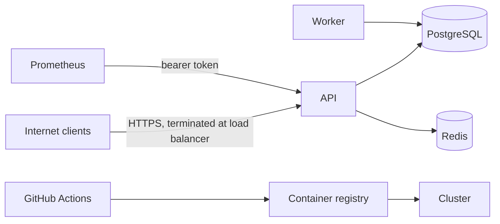

# Amrutam Telemedicine Backend: Threat Model and Security Checklist

Scope: the API, worker, PostgreSQL, Redis, container image and CI pipeline in this repository. Statuses used throughout: **Done** (implemented and covered by tests or CI), **Partial**, **Not done** (a known gap, listed honestly in section 7).

## 1. Assets and data classification

| Class | Data | Protection |
|---|---|---|
| **Restricted** (medical) | Prescriptions, clinical notes | AES-256-GCM at rest, bound to the row; readable only by the patient and treating doctor (not admins); every read audited |
| **Restricted** (credentials) | Password hashes, refresh tokens, MFA secrets | bcrypt; refresh tokens stored only as SHA-256 hashes; MFA secrets encrypted |
| **Confidential** (PII) | Phone number (encrypted), email, name, date of birth, gender (stored in plain text columns) | Role-based access; only phone is field-encrypted. Encrypting date of birth is a possible hardening |
| **Financial** | Payment records | Mock gateway, no card data ever touches this system |
| **Integrity-critical** | Audit log, slot and consultation state | Append-only trigger, database constraints |
| **Public** | Doctor name, specialization, fee, bio, open slots | Available to any authenticated user |

## 2. Attack surface and trust boundaries

Entry points: unauthenticated (`register`, `login`, `refresh`, `mfa/verify`, health checks, `/metrics` behind an optional token); authenticated user routes; doctor routes; admin routes. There are no outbound requests to user-supplied URLs, no file uploads and no HTML rendering, which removes whole classes of attack (SSRF, upload abuse, XSS in this service).

## 3. OWASP Top 10 (2021) mitigations

| # | Risk | What this project does | Status |
|---|---|---|---|
| A01 | Broken access control | Role checks on every route; ownership filters on every query (patients see only their own consultations, doctors only theirs); resources you may not see return **404**, not 403, so existence is not leaked; admins cannot read notes or prescriptions; a doctor can cancel only their own slots. Covered by tests | Done |
| A02 | Cryptographic failures | bcrypt for passwords; AES-256-GCM field encryption with a versioned key ring and additional authenticated data; JWT signing secret must be 32+ characters (validated at startup); TLS is assumed at the load balancer | Done (TLS is infrastructure) |
| A03 | Injection | Prisma parameterizes all queries; the few raw SQL statements use tagged templates, so values are bound parameters; every body and query is validated with Zod and unknown fields are stripped | Done |
| A04 | Insecure design | Business rules enforced by the database, not just code: no overlapping slots, one active consultation per slot, idempotency keys, hold limits (max 3 unpaid holds), append-only audit log | Done |
| A05 | Security misconfiguration | `helmet` headers; invalid configuration stops the process at startup; errors never leak stack traces; container runs as non-root, npm/yarn/TypeScript removed from the image; Kubernetes pods use a read-only filesystem, dropped capabilities and non-root user; `/metrics` can require a token | Done (CORS not configured, see section 7) |
| A06 | Vulnerable components | `npm audit` on production dependencies, Trivy image scan, gitleaks secret scan and CodeQL on every push (section 6) | Done |
| A07 | Authentication failures | Rate limits on auth routes; constant-time-style login (dummy hash when the user does not exist); TOTP MFA with replay protection; refresh-token rotation with reuse detection; password change and MFA disable revoke every session | Done |
| A08 | Software and data integrity | Lockfile-pinned installs (`npm ci`), reviewed migrations, CI gates before an image is built, audit rows cannot be updated or deleted through SQL row operations | Partial (no payment webhook signature: mock gateway) |
| A09 | Logging and monitoring | Security-relevant events in the audit log, structured logs with secrets redacted, metrics and alerts (5xx budget, dead events, worker down) | Done |
| A10 | Server-side request forgery | No feature makes outbound requests from user input | Not applicable |

## 4. Threats to the booking and medical-data flows

| Threat | Mitigation | Residual risk |
|---|---|---|
| Double booking via simultaneous requests | Single conditional UPDATE, exclusion constraint, unique index; a test races 30 patients for one slot | None known |
| Retried or replayed request creates duplicates or double charges | Mandatory `Idempotency-Key` on booking, payment and prescription; same key with different body returns 422 | Keys live 24 h |
| Hoarding: one account holds many slots | Max 3 unpaid holds per patient; holds expire after 10 minutes | Many accounts could still hold slots; registration has no email verification |
| Patient reads another patient's data (IDOR) | Ownership check in the query itself; 404 for foreign ids | None known |
| Admin account misused to browse medical data | Admins have no route to notes or prescriptions; admin actions are audited | An admin with database access could still read ciphertext (not plaintext without the key) |
| Encrypted value copied to another row | Ciphertext is bound to its row through AAD, so it fails to decrypt elsewhere | None known |
| Stolen refresh token | Tokens rotate on every use; replay of an old token revokes all sessions and is audited | Stolen token usable once before rotation |
| Stolen or guessed TOTP code | Codes work once (replay protection); 30 s window with 1 step of tolerance; rate-limited | No per-account lockout, only per-IP limits |
| Credential stuffing | Per-IP rate limit (20 per 15 minutes on auth routes), failed logins audited with a hashed email | Distributed attacks across many IPs; add per-account lockout |
| Tampering with history | Audit trigger blocks UPDATE and DELETE; PHI reads are audited before data is returned (fail closed) | A database superuser can disable the trigger or drop a partition; ship logs to write-once storage |
| Denial of service | Body limit 100 KB, page size caps (50 to 100), global rate limit, worker isolated from the API | No per-request timeout; volumetric attacks need a CDN or WAF |

## 5. Encryption and key rotation

Fields encrypted at rest: prescription content, consultation notes, patient phone number, MFA secrets. Format `keyId.iv.tag.ciphertext`, AES-256-GCM with a random 96-bit IV per value.

Rotation without downtime (implemented and tested): add the new key to `ENCRYPTION_KEYS` next to the old one, set `ENCRYPTION_ACTIVE_KEY_ID` to the new id and deploy (new writes use the new key, old data still decrypts), run `npm run rotate-keys` to re-encrypt existing rows (conditional updates, so concurrent edits are never overwritten; safe to re-run), and remove the old key when the script reports zero. If a key is suspected compromised, rotate immediately and treat data encrypted under it as exposed.

The JWT signing secret is a separate secret. Rotating it invalidates all access tokens (15 minute lifetime) and MFA challenge tokens; refresh tokens are unaffected because they are random values, not JWTs.

## 6. Audit logging and dependency scanning

**Audit log.** Recorded in the same transaction as the change: registration, login success and failure, refresh-token reuse, MFA events, profile and password changes, doctor and slot changes, booking, payment, every consultation transition, prescription creation, and every view of a consultation or prescription. Each row stores actor, role, IP, user agent, entity and timestamp. The table is partitioned by month and append-only; the admin API filters by actor, entity, action and date with keyset pagination.

**Dependency and supply-chain scanning (runs on every push).**
- `npm audit --omit=dev` fails on high-severity production vulnerabilities.
- Trivy scans the built container image and fails on fixable high or critical findings.
- gitleaks scans for committed secrets; CodeQL analyses the source.
- Installs use `npm ci` from a committed lockfile.

These found real issues during development, which were fixed and are worth mentioning: a high-severity advisory in `deepmerge-ts`, pulled in by Prisma's CLI, fixed with a pinned override; npm's own bundled packages flagged in the base image, fixed by removing npm from the runtime image; and TypeScript's native Go compiler binary, pulled into production by an optional peer dependency, removed from the image.

## 7. Known gaps and residual risks

- **Payments are a mock gateway**: a real gateway needs a webhook with signature verification and replay protection.
- **No CORS policy** is configured: browser front ends on another origin would need one. Authentication uses bearer tokens, not cookies, so CSRF does not apply.
- **No account lockout or email verification**, and no password-reset flow: login abuse is limited by per-IP rate limits only.
- **JWT uses one shared HS256 secret** without key ids, so rotation invalidates all access tokens at once; an asymmetric key pair with `kid` would allow gradual rotation.
- **Deactivated users** keep a working access token for up to 15 minutes (their refresh tokens are revoked immediately).
- **Secrets are delivered as environment variables**; production should use a secret manager and rotate on a schedule.
- **Date of birth, gender and email are not field-encrypted.**
- **Data retention and erasure** (for example patient deletion requests and legal retention periods for medical records) are not implemented and need a policy decision.
- **Audit tamper-evidence** is enforced in the database only; exporting to write-once storage would protect against a compromised database administrator.
- **TLS, WAF and network policies** are deployment concerns not contained in this repository.

## 8. Security checklist

| Control | Status |
|---|---|
| Passwords hashed with bcrypt, length limited to 72 | Done |
| Role-based access control on every route, ownership enforced in queries | Done |
| TOTP MFA with replay protection; enforceable for staff | Done |
| Short-lived access tokens, rotating refresh tokens with reuse detection | Done |
| Rate limiting (global and stricter on authentication), shared across instances via Redis | Done |
| Input validation on all bodies and queries; parameterized queries only | Done |
| Uniform error format, no internal details leaked | Done |
| Security headers (helmet); request size limit | Done |
| Field-level encryption with rotatable keys | Done |
| Least privilege for medical data (admins excluded); reads audited | Done |
| Append-only audit log, partitioned by month | Done |
| Idempotency and database constraints against duplicate or conflicting writes | Done |
| Secrets never logged (redaction) or committed (gitleaks) | Done |
| Non-root container, minimal runtime image, read-only Kubernetes filesystem | Done |
| Dependency, image, secret and static-code scanning in CI | Done |
| Metrics protected by token; alerts on error budget and dead events | Done |
| TLS termination, WAF, network policies | Partial (infrastructure) |
| Secret manager integration and scheduled secret rotation | Partial |
| Payment webhook signature verification | Not done (mock gateway) |
| Per-account lockout, email verification, password reset | Not done |
| CORS policy | Not done |
| Data retention and erasure policy | Not done |
