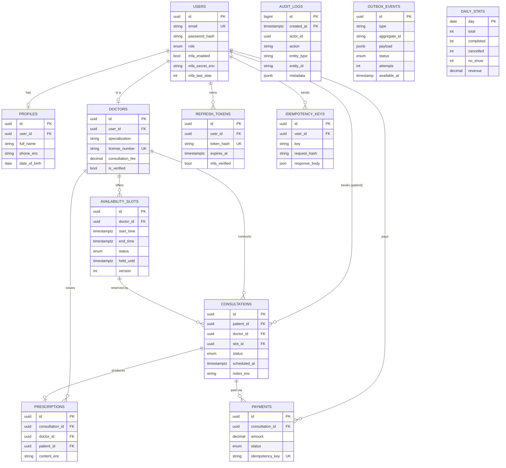

# ER Diagram

`AUDIT_LOGS` has no foreign keys by design: append-only, cheap writes, and it survives user deletion.
It is **range-partitioned by month** on `created_at` (so the primary key is `(id, created_at)`), and a database trigger
rejects UPDATE and DELETE, so rows can only be appended.

`OUTBOX_EVENTS` is the transactional outbox: written in the same transaction as the state change it announces,
delivered later by the worker with retry and exponential backoff. `DAILY_STATS` is the pre-aggregated table behind the
admin analytics. Neither has foreign keys.

Two database constraints do the heavy lifting for booking correctness (see the slot migration):
`no_overlapping_slots` (exclusion constraint) and `uniq_active_consultation_per_slot` (partial unique index).
